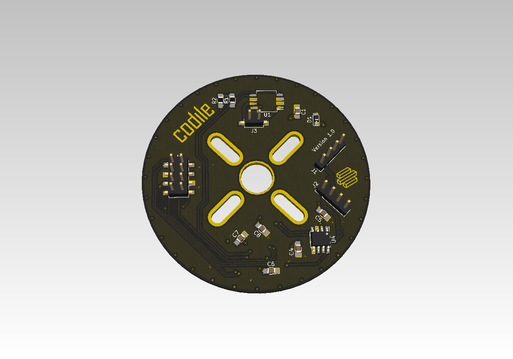

ECU for the Standard Wheel Module
=================================

This is the KiCad project for the ECU for the wheel/gearbox/motor unit.

Licence
-------

Licenced under the CERN Open Hardware Licence v1.2.
